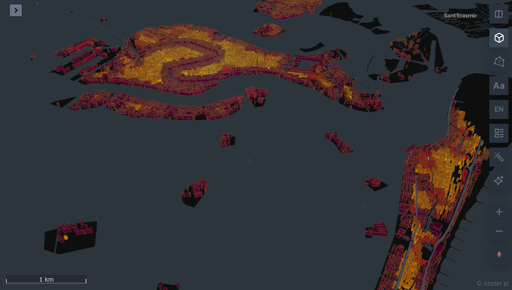
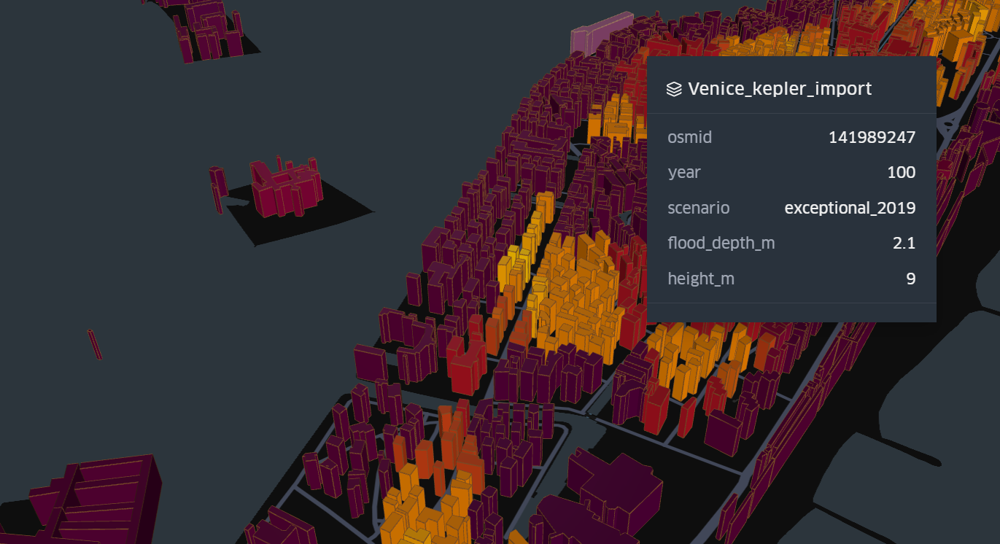

# Venice Subsidence & Sea-Level Digital Twin

A 3D digital twin of Venice showing how ground subsidence (measured via Copernicus
InSAR satellite data) combined with sea-level / acqua-alta scenarios puts building
footprints underwater over time — built end-to-end on free, public geospatial data.





## What this shows

Each building footprint is placed at its real ground elevation, adjusted for
measured local subsidence, and checked against three tide scenarios (a normal
high tide, a moderate acqua alta, and the historic 12 Nov 2019 record flood at
1.87m). The result: which buildings flood, by how much, today versus 10/20/30/50/100
years from now as the ground continues to sink.

Under the 2019-flood scenario, **~66–76% of buildings** in the AOI show a positive
flood depth today, rising further as subsidence accumulates — broadly consistent
with historical accounts of that flood affecting the large majority of the city.

## Data sources (all free, no paid access)

| Source | What | Access |
|---|---|---|
| [OpenStreetMap](https://www.openstreetmap.org/) | Building footprints | Public, no auth |
| [Copernicus DEM GLO-30](https://registry.opendata.aws/copernicus-dem/) | Ground elevation (30m) | Public AWS bucket, no auth |
| [Comune di Venezia open data](https://dati.venezia.it/) | Live tide levels + forecasts | Public JSON, no auth |
| [Copernicus EGMS](https://egms.land.copernicus.eu/) | InSAR ground-subsidence velocity | Free CLMS account + API token |

## Pipeline

```
scripts/
  01_fetch_osm_buildings.py   -> OSM building footprints for the Venice AOI
  02_fetch_dem.py             -> Copernicus DEM GLO-30 elevation, clipped to AOI
  03_fetch_tide_data.py       -> live + astronomical tide levels from dati.venezia.it
  04_fetch_egms.py            -> InSAR subsidence points from Copernicus EGMS (needs a free token)
  05_build_flood_model.py     -> ground elevation (DSM minimum-filtered to approximate
                                  bare earth) - subsidence(years) vs tide level
                                  -> per-building flood depth
  06_export_map.py            -> self-contained deck.gl HTML, year/scenario sliders
  07_export_for_kepler.py     -> long-format GeoJSON ready to drag into kepler.gl/demo
  08_export_cesium.py         -> self-contained CesiumJS true-3D-globe HTML
```

Run them in order; each writes into `data/raw/`, `data/processed/`, or `outputs/`.

## Setup

```bash
python -m venv .venv
.venv\Scripts\activate
pip install -r requirements.txt
```

## Manual step: EGMS token

EGMS (ground subsidence) requires a free Copernicus Land Monitoring Service account:

1. Register at https://land.copernicus.eu/en (free)
2. Go to your profile -> **API Tokens** -> **Create new Token**
3. Save the JSON it shows you as `token.jwt` in the project root (already gitignored)

Everything else (OSM, DEM, tide data) runs with no login.

## Viewing the outputs

The exported HTML files in `outputs/` use Web Workers (Cesium/MapLibre) and won't
render correctly if just double-clicked (`file://` pages block some of what they
need). Serve them locally instead:

```bash
cd outputs
python -m http.server 8800
```

Then open `http://localhost:8800/venice_digital_twin.html` (or
`venice_cesium_twin.html`) in a browser. For the Kepler.gl version, drag
`venice_kepler_import.geojson` directly onto https://kepler.gl/demo.

## Area of interest

Default AOI is the Venice historic center + lagoon fringe. Edit `AOI_BBOX` in
`scripts/config.py` to adjust.

## Known limitations

- **DEM resolution**: Copernicus DEM GLO-30 is a 30m *surface* model (DSM), not a
  surveyed bare-earth terrain model. A minimum filter approximates ground level
  by taking the lowest nearby pixel, calibrated so the AOI-wide mean (0.91m)
  matches Venice's documented historic-center average (~0.90m) — but this is a
  screening-level approximation, not survey-grade elevation.
- **Building floor thresholds** (raised sills, steps) aren't modeled — actual
  flood entry into buildings will differ from the raw ground-level comparison here.
- **Subsidence** is interpolated from real EGMS InSAR points but at 30m-scale
  raster resolution; it captures the regional trend, not building-by-building
  structural risk.

This project is a portfolio/illustrative piece, not an engineering-grade flood
risk assessment.
